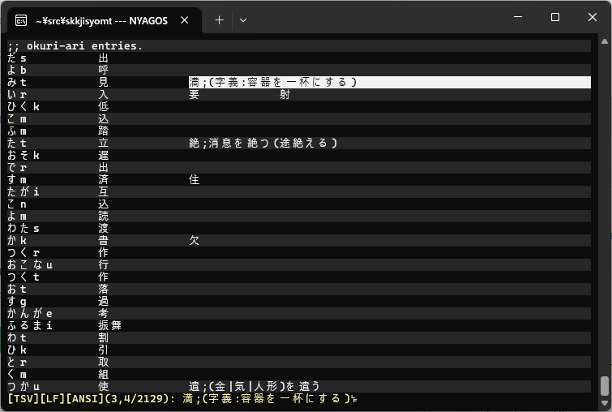

skkjisyomt
==========

[ターミナル用CSVエディタ](https://github.com/hymkor/csvi) を呼び出して、.skk-jisyo をメンテするやつです。

CSVエディタを呼ぶ前後でスラッシュをタブ文字に変換したりして、.skk-jisyo を TSV テキストに見せかけているだけなので、変なことをすると変なことになります。

```
$ go install github.com/hymkor/skkjisyomt@latest

$ skkjisyomt ~/.skk-jisyo
```



保存する時は `q` → `y` と入力してください。
